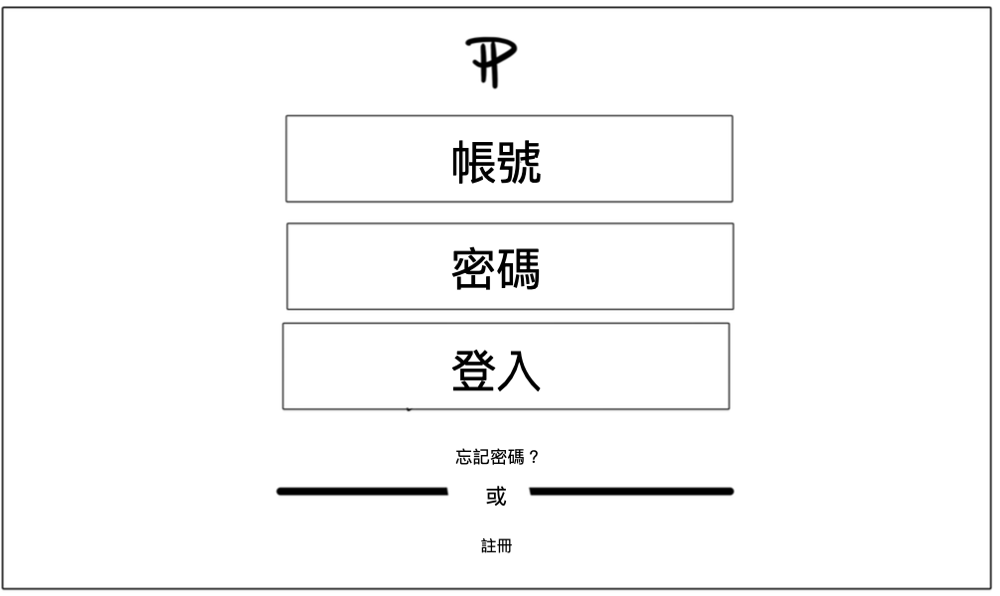
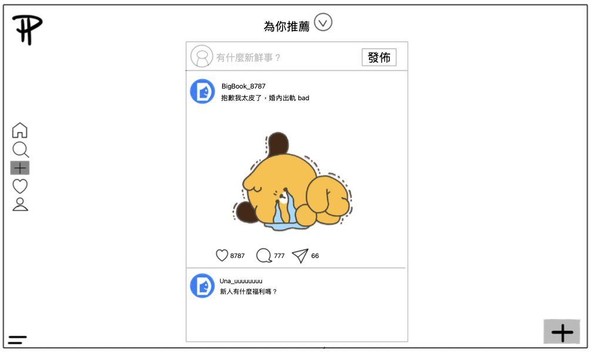
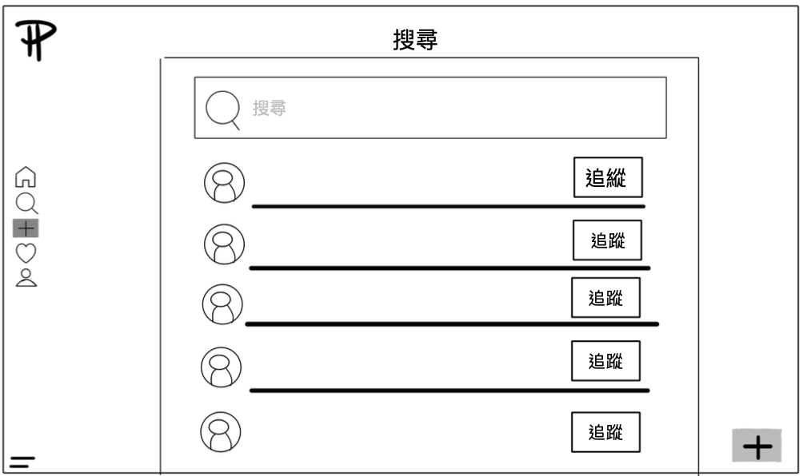
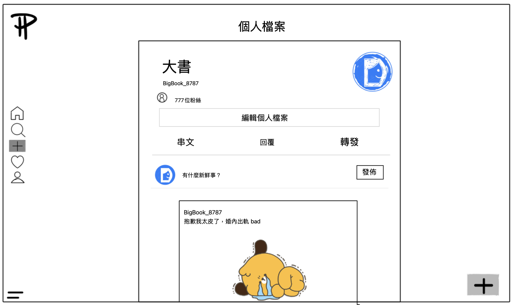
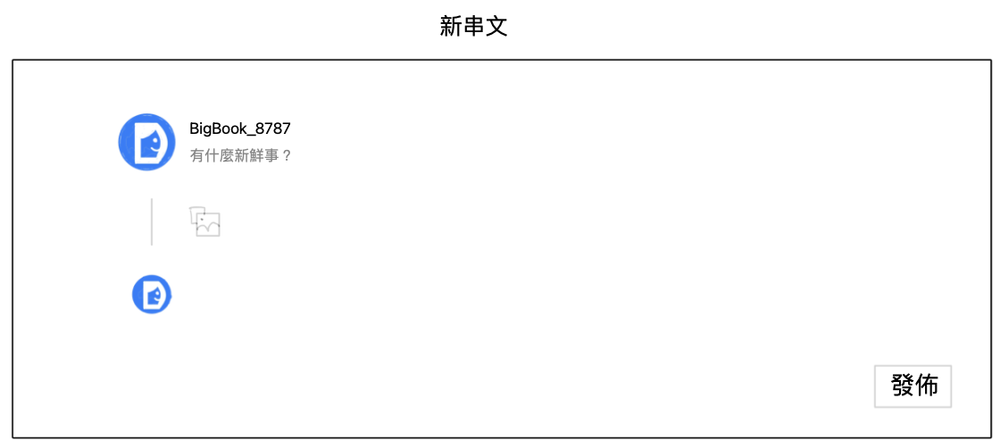
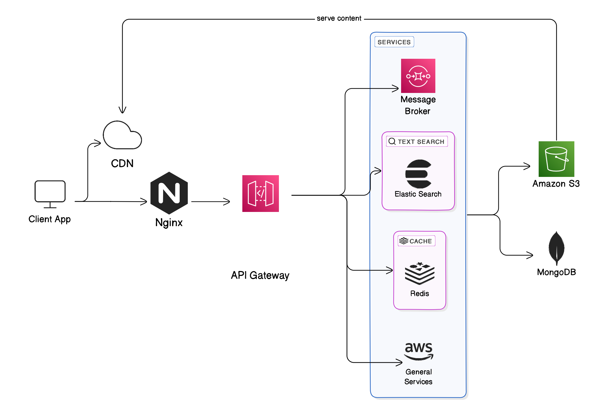

## 專案題目

### 1. 專案名稱 : Processes ( 復刻 Threads )

### 2. 功能排序

- 基礎功能 : 社群網站基本功能 e.g.
  - 用戶登入與檔案 : 包含 native 與 第三方登入
  - 貼文內容 : 新增、刪除、修改
  - 社群互動 : 留言、愛心
- 核心功能
  - 搜尋優化
  - 推薦演算法

### 3. 技術

- 前端 : React
- 後端 : JS/TS
- 資料庫 : MongoDB

### 4. wireframe 與 系統架構圖

#### wireframe

#### 系統架構圖

#### 系統概述

###### 主要目的

建立一個類似 Thread 的社群平台，支援即時貼文、互動和內容分享。

#### 核心組件

###### 1. Client App

- 使用者介面
- 讓用戶能夠瀏覽、發布貼文和互動

##### 2. CDN (Content Delivery Network)

- 加速內容傳遞
- 提升使用者體驗，特別是圖片和影片等媒體內容

##### 3. Nginx

- 作為負載平衡器
- 確保系統在高流量下的穩定性

##### 4. API Gateway

- 管理所有外部請求
- 路由到適當的內部服務

##### 5. 服務層

- **Message Broker**：處理即時訊息和通知
- **Elastic Search**：支援全文檢索，便於用戶搜尋貼文和話題
- **Redis**：快取熱門內容和使用者資料，提升回應速度

##### 6. 儲存層

- **Amazon S3**：儲存用戶上傳的媒體檔案
- **MongoDB**：作為主要資料庫，儲存用戶資料、貼文和互動紀錄

#### 特點

- **高可用性**：支援大量同時在線用戶
- **可擴展性**：因應用戶成長和流量變化，可快速擴充系統資源
- **低延遲**：提供近乎即時的貼文發布和互動體驗
- **彈性架構**：採用微服務設計，便於未來功能擴充和維護

---

這個系統架構專為打造類似 Thread 的社群媒體平台而設計，能夠處理大量並發用戶，支援即時貼文、互動和內容分享，同時保持系統的可靠性和擴展性。透過這樣的設計，我們旨在提供一個流暢、互動性高的社群體驗。

## 如何設計推薦演算法？有什麼相關參數？

我們預計採用混合模型，結合基於內容的推薦 (Content-Based Filtering) 和協同過濾 (Collaborative Filtering) 來設計推薦演算法，並參考 Twitter 和 Instagram 的模型設計來優化推薦邏輯，提供個性化和多樣性的內容推薦。

### 1. 基於內容的推薦

- 推薦邏輯：根據用戶過去喜歡的貼文內容（例如標籤、主題）來推薦相似內容。使用 TF-IDF 或 Word Embeddings（如 Word2Vec）計算內容相似度。

- 關鍵參數：

  - 貼文標籤和關鍵詞的相似度。
  - 貼文的類型（例如圖片、影片、文字）。
  - 與用戶過去喜好相關的其他特徵（例如地點、時間）。

- 參考： Instagram 使用圖片和文本特徵來推薦相似內容， Twitter 也使用相同文本特徵提供用戶感興趣主題相關的推文推薦。

### 2. 協同過濾

- 推薦邏輯：根據其他與當前用戶行為相似的用戶來推薦他們喜歡的內容。這種方式適合有大量用戶行為資料時，可以從中挖掘相似的行為模式。

- 關鍵參數：

  - 用戶之間的相似度（例如共同關注的帳號）。
  - 貼文之間的互動資料相似度（例如 A 和 B 用戶都按過愛心的貼文）。
  - 用戶的歷史行為（例如評論、分享）。

- 參考： Twitter 的 SimClusters 模型會基於用戶之間的社交行為和共同喜好來推薦內容， Instagram 也根據用戶的互動資料來優化 feed 排序和推薦。

### 3. 混合模型

- 推薦邏輯：由於不同用戶的資料量和行為習慣不同，我們可以將基於內容和協同過濾的推薦系統進行混合，這樣能夠根據具體情況靈活選擇最佳的推薦方式。

- 推薦策略：

  - 當用戶的行為資料不足時，使用基於內容的推薦。
  - 當用戶資料充足時，使用協同過濾來提高推薦準確性。
  - 引入隨機推薦或多樣性推薦來打破回聲室效應（Echo Chamber Effect）。

- 關鍵參數：

  - 行為權重：設置不同用戶行為的權重，例如按愛心、評論等更能反映用戶的興趣，應該設定更高的權重。
  - 時效性：考慮貼文的發佈時間，確保用戶看到最新的相關內容。
  - 熱門度和多樣性：推薦系統應該考慮熱門內容，同時保證內容的多樣性，避免回聲室效應。

- 參考： Twitter 的推薦系統結合基於內容的模型和協同過濾來推薦推文， Instagram 則是使用基於內容推薦為新用戶提供內容，並結合協同過濾來進行個性化推薦。

## 如何提高 qps 或是降低響應速度?

### 1. 提高 QPS 的策略

- 資料庫讀寫分離（讀操作分配到從庫）\
  因為大多數社交媒體的讀取操作遠遠多於寫入操作。通過將讀操作分配到多個從庫，能降低主庫的負擔，提升整體的並行讀取能力。
- 用戶分類及 Redis 快取策略（活躍 vs 非活躍用戶）\
  根據用戶的活躍度對快取策略進行分配，為最需要快速響應的用戶提供更多的資源，例如緩存更多貼文，提升整體 QPS 表現。
- Redis 緩存熱門文章和用戶資料 \
  將熱門文章及使用者資料（如個人資訊）快取到 Redis 中，減少對資料庫的頻繁讀取，能減少後端壓力，提升服務對於熱門資料查詢的並發能力。
- 非同步處理與消息隊列 \
  使用消息隊列將非必要的計算工作（如貼文的點讚數、通知等）進行異步處理，避免在同步流程中執行耗時的計算操作，減少後端阻塞，提升系統的並行查詢處理能力。
- 動態擴展服務器節點（Kubernetes）\
  利用 Kubernetes 進行水平擴展，在高流量時動態增加伺服器節點以應對請求量，確保高併發下的 QPS 穩定增長。

### 2. 降低響應時間的策略

- 主頁貼文分批返回（分頁，Pagination）\
  分批返回貼文而不是一次性返回所有貼文，減少一次請求的響應時間和傳輸數據量，改善使用者體驗。
- 使用 CDN 緩存靜態資源 \
  CDN 可以降低圖片、CSS、JavaScript 等靜態資源的加載時間，減少伺服器的負載並優化整體的使用者體驗。
- Redis 緩存熱門文章和用戶資料 \
  對於頻繁查詢的數據來說，如熱門貼文和用戶個人資料，直接從 Redis 中獲取可以降低資料獲取的延遲。
- 只快取文章索引，而非文章內容 \
  對於文章內容較多的情況，只快取文章索引，從 Redis 中快速讀取索引後，再通過索引去查找具體的資料庫資料。
- 連接池 \
  使用資料庫連接池來有效管理連接，避免頻繁創建和關閉連接的開銷。

## 資料庫的選擇

我們選擇使用 MongoDB 做為我們主要儲存資料的 database。

### 為什麼選擇 MongoDB？

1. **document model 適合社交媒體的資料**:

   - MongoDB 是一個 doucument database，非常適合儲存貼文、評論、用戶資料等非結構化資料。
   - 相比 key-value（如 Redis）或 Column-oriented 形式儲存（如 Cassandra），document model 更直觀且靈活。

2. **查詢能力強**:

   - MongoDB 提供豐富的查詢語言，支持複雜查詢、聚合操作和全文搜索。
   - 相比 HBase 或 Cassandra，MongoDB 的查詢功能更強大，更適合需要多樣化查詢的社交平台。

3. **擴展性好**:

   - MongoDB 的分片 (sharding) 功能允許水平擴展，可以處理 Thread 增長的資料量。
   - 雖然 Cassandra 在擴展性上可能更勝一籌，但 MongoDB 的擴展模型對開發者來說更友好。

4. **成本效益**
   - 在設計大型系統時，通常會採用多種資料庫技術來滿足不同的需求。但同時維護多個資料庫的成本很高，MongoDB 也可以做到關聯式資料庫的操作。
   - 雖然 Redis 好像什麼都可以扛，但是他是記憶體資料庫所以成本較高。用來當作 cache 較為合適。

### 為什麼不選擇關聯式數據庫

1. **靈活性**:

   - 社交媒體功能經常變化，MongoDB 的 NoSQL 設計允許快速調整 data model。
   - 關聯式數據庫的 strict desgin 可能會降低開發速度。

2. **擴展性**:

   - MongoDB 的水平擴展比傳統關聯式資料庫更容易實現。
   - 關聯式資料庫的垂直擴展可能無法滿足高增長的需求。

3. **性能**:
   - 對於讀操作密集的社交媒體應用，MongoDB 可能提供更好的性能。
   - 複雜的 JOIN 操作在大規模資料下可能成為關聯式資料庫的瓶頸。

## 哪些資訊可以運用 cache ?

1. 緩存首頁 feed 和個人 feed，當追蹤的用戶發布新貼文時，直接更新緩存。
2. 用戶好友列表和關係數據快取，以減少大量讀取關聯表的開銷。
3. 將需要推送的通知或消息緩存在 Redis 中，這樣當用戶上線時，能迅速獲取待處理的通知。
4. 將用戶最近的行為資料（如最近瀏覽、點讚的貼文）暫時快取在 Redis 中，用於推薦算法和個性化推送。

## 大規模文字搜尋

### 1. 情境與瓶頸

在社群網站中，用戶創作內容的速度非常快，數量龐大。如果用戶想要進行所有貼文的全文檢索，搜索範圍非常廣，導致搜尋成本極高。

### 2. 倒排索引（Inverted Index）

倒排索引（Inverted Index）是一種用於降低全文搜索成本的資料結構。

- **傳統思路**：文件 -> 搜尋關鍵字
  要遍歷每篇文章，時間複雜度高。
- **倒排索引**：關鍵字 -> 文件列表
  事先構建一個詞彙表，並將每個詞彙與出現該詞彙的所有文章關聯起來，直接找到該關鍵字，直接回傳包含這個關鍵字的貼文們。

### 3. 如何生成倒排索引 - 斷詞

我們不需要將整篇文章中的每個詞彙都當作關鍵字。因此要透過**斷詞工具**來選擇哪些詞要保留並成為關鍵字，提高搜索效率。

- **中文斷詞**：用常見的中文斷詞套件（如結巴分詞），將句子拆解為詞彙，然後建立詞彙表和倒排列表。
- **儲存和更新**：當用戶新增文章時，就開始計算斷詞結果，產生關鍵詞加入索引，並將文章 ID 存入相關關鍵詞的倒排列表中。
  - **詞彙表（Term Dictionary）**：儲存所有獨特的詞彙。
  - **倒排列表（Posting List）**：每個詞彙對應的貼文 ID 列表。

### 4. 合適資料庫

**Elasticsearch**，是專為全文檢索和大規模資料搜索設計的分布式搜索引擎。

- 優點 : 原生支持倒排索引結構，搜索功能高效
- 缺點 : 硬體規格限制成本高，如記憶體要求 8G ，但 AWS 免費方案 t2.micro 只有 1G

## 熱門推文問題

### 1. 情境與瓶頸

Threads 首頁會顯示所有社群貼文，這些貼文可能來自朋友、新聞媒體、或你不認識的帳號的熱門內容推薦。這些顯示的貼文依賴於系統設計的 News Feed 系統，透過訂閱（Subscription）關係來決定每位使用者應該看到哪些內容。

然而，在內容多樣又龐大的社群媒體中，會遇到以下瓶頸：

- **龐大的資料量**：每秒都有一堆貼文生出來，系統如何在這麼多內容中，快速且有效地展示最相關的部分?

- **即時性**：當熱門帳號（如 KOL 或新聞帳號）發布新內容時，必須在最短時間內推送給所有追隨者，避免重大新聞卻有人隔半天才收到消息。

- **個人化與排序**：如何決定哪些貼文優先展示，可能要看於互動（點讚、評論、分享），或社交網路的強度。這需要有好的**推薦演算法**產生最佳內容與排序來顯示。

### 2. Subscription 系統設計

好的 Subscription 系統，能讓每位用戶點點開首頁時，能夠看到最新、最相關的內容，目前我們為了確保大家能看到最新的消息，整理的議題：

#### **資料擴散（Fan-out）**

當一個熱門帳號發布貼文時，這個貼文需要擴散到其所有追隨者的消息流中。這種情境下，每次發表貼文等於同時觸發大量的資料寫入操作，特別是當帳號擁有數百萬粉絲時，這會對系統形成巨大的壓力。

- **高寫入壓力**：每次大帳號發文時，系統需要立即處理大量寫入，將消息分發給所有追隨者的動態牆中，容易導致性能瓶頸。

- **延遲問題**：若追隨者數量龐大，可能會導致系統無法及時推送內容，使得用戶看到的內容不是即時的，體驗大打折扣。

#### **解決方案**

- **Pull-based 模式**：等用戶打開首頁時才拉取他們的訂閱內容。這樣可以減少即時寫入的壓力，將計算延遲到用戶查詢的時間點進行處理。

- **混合 Push-Pull 模式**：對於活躍用戶，系統就即時推送貼文；而對於一般用戶或不活躍用戶，則可以使用 Pull 模式來延遲處理，這樣可以在確保重要內容及時推送的同時，平衡系統負載。

- **快取**：熱門內容，可以考慮先用快取存起來，當用戶需要查看時，減少資料庫的壓力。

## 團隊合作

### 1. Branching Model : GitHub Flow

比 git 多兩個服務，一個是 fork，另一個是 pull request（PR），以及 issue tracking 用法

先有一個共有的遠端倉庫 ( remote repository )，再各自 fork 回到自己的倉庫。開發好後，再發 PR 回去共有遠端倉庫，審核過後 merge 進 main

- 以 `main` 分支為主
- 其他分支，以 feature-driven 做開發
- 發 PR 時，設定至少一人 review 後才能 merge

### 2. [Trello 連結](https://trello.com/invite/b/6700c979269fd7ec893df31d/ATTIca1e94314681e3715094c133aec74204FE423D46/小組看板)

固定開會時間 : 週三晚上
